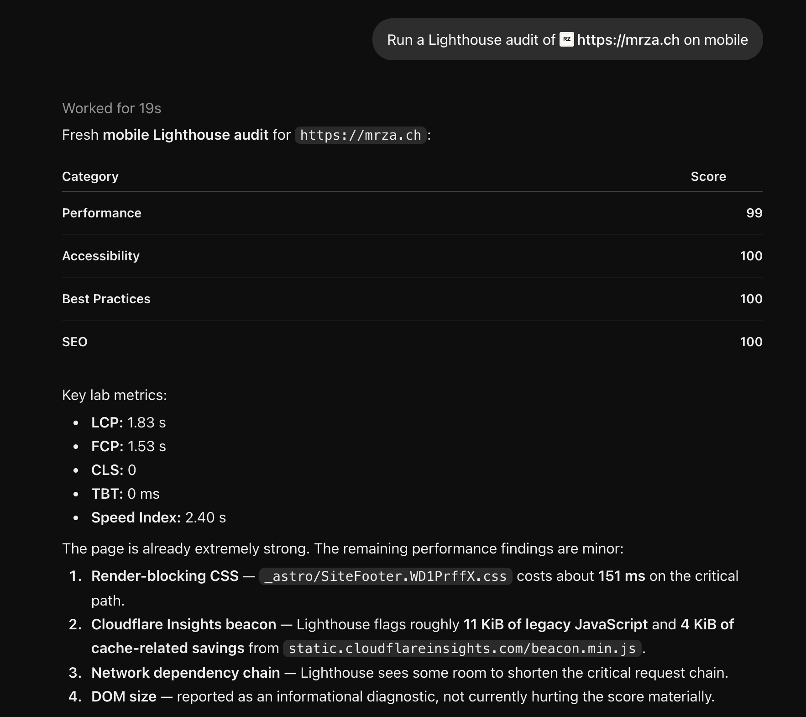

# Lighthouse Audit

[](https://github.com/reinhard-z/lighthouse-audit/actions/workflows/ci.yml)
[](https://glama.ai/mcp/servers/reinhard-z/lighthouse-audit)
[](LICENSE)

Fresh website performance, accessibility, and SEO checks. No separate signup.

Lighthouse Audit is a remote [MCP](https://modelcontextprotocol.io/) server. Connect it to ChatGPT or another MCP client, give it the address of a public web page, and it runs a new Lighthouse audit of that page covering performance, accessibility, best practices and SEO. Your client reads the results and explains them to you. The server itself doesn't use a language model.

Uses Lighthouse via Google PageSpeed Insights. Independently developed by Reinhard Zach; not affiliated with Google or OpenAI.



_ChatGPT with this server connected. Asked to audit a page on mobile, it called `run_lighthouse` and summarized the result: category scores, lab metrics and the most important findings. The whole exchange took about 19 seconds._

## Connect

Add this endpoint as a remote MCP server in your client and choose no authentication:

```text
https://audit.mrza.ch/mcp
```

The server uses Streamable HTTP. In ChatGPT, you can add custom MCP servers in developer mode if your plan includes it. It's also listed on [Glama](https://glama.ai/mcp/servers/reinhard-z/lighthouse-audit).

You don't need an account, a Google login or an API key for this service. Your client may still ask you to sign in, or to approve the connection and each tool call.

Things to try:

- “Run a Lighthouse audit of https://mrza.ch on mobile.”
- “Which performance, accessibility, or SEO issues should I investigate first?”
- “I deployed a change. Run a fresh audit of https://mrza.ch and compare it with the previous result in this conversation.”

## The tool

There is one tool, `run_lighthouse`, with two arguments:

| Argument | Type                    | Notes                                                        |
| -------- | ----------------------- | ------------------------------------------------------------ |
| `url`    | string                  | A public `http://` or `https://` URL, up to 2,048 characters |
| `device` | `"mobile" \| "desktop"` | Optional, defaults to `mobile`                               |

Each call sends one request to PageSpeed Insights and audits one page on one device. Nothing is cached or stored, so every call is a new audit. Most audits take around 10 seconds. The server stops after 57 seconds and returns `AUDIT_TIMEOUT` (see [Limitations](#limitations)).

The result is a single JSON object (`schemaVersion` `"1.0"`), sent both as structured content and as text. It contains:

- the four category scores, from 0 to 100
- lab metrics: LCP, FCP, CLS, TBT and Speed Index
- up to 20 findings, most important first, each with a few examples from the page
- manual checks, audit errors, counts and warnings

If the audit fails, you get an error code instead, such as `INVALID_URL`, `UNSUPPORTED_TARGET`, `CAPACITY_EXCEEDED` or `PAGE_LOAD_FAILED`, with a short message and a `retryable` flag. Results are capped at 32 KiB. If a list or its details had to be shortened, `truncated` is `true`.

## Limitations

It only audits public HTTP(S) pages. Requests for local or private-network addresses, IP addresses, non-default ports, URLs with a username or password, and URLs whose query string looks like it holds a secret are refused. That last check only catches obvious cases, so don't send URLs that contain anything confidential.

It audits one page per call. It can't crawl a site, run on a schedule or keep a history. To compare two runs, ask your client to compare results that are already in the conversation.

Very heavy pages can't be audited. ChatGPT, like many MCP clients, stops waiting for a tool call after about a minute, and the server can't extend that: ChatGPT doesn't accept progress updates, and handing back the result in a later call would need storage this service doesn't have. So the server stops after 57 seconds and returns `AUDIT_TIMEOUT`. Most pages finish in 10 to 20 seconds, but some large news and shopping sites take Google 70 to 90 seconds. ChatGPT usually retries once, so you may wait about two minutes before you see the error. Sites that block automated browsers fail as well. For those pages, use [PageSpeed Insights](https://pagespeed.web.dev/) directly.

The numbers are lab data from a single emulated page load, not real-user Core Web Vitals, and scores vary a little from run to run. Automated accessibility checks find only some of the problems a full review would, and a good SEO score doesn't mean good rankings.

Page titles, descriptions, URLs and snippets in the results come from the audited page and from Google. Treat them as untrusted input.

Capacity is limited and shared. The service runs on free tiers. Google allows this project 25,000 PageSpeed Insights requests a day and 30 a minute, for all users together, and the daily quota resets at midnight Pacific Time. There are no accounts or per-user limits, so one heavy user can use up the quota for everyone. When that happens, audits fail with `CAPACITY_EXCEEDED` until the minute is over or the daily quota resets. Don't retry automatically. Audits may also be switched off at any time to protect the quota.

The [privacy page](https://audit.mrza.ch/privacy) explains what happens to the URLs you submit.

## Run it locally

You can also run the same tool on your own machine as a local (stdio) MCP server, with your own PageSpeed Insights API key. It then uses your Google quota instead of the shared one. It needs Node.js 22.18 or later, pnpm 11 and a [PageSpeed Insights API key](https://developers.google.com/speed/docs/insights/v5/get-started).

```sh
git clone https://github.com/reinhard-z/lighthouse-audit.git
cd lighthouse-audit
pnpm install --frozen-lockfile
```

Then add it to your MCP client. Most clients take a configuration like this; replace the path and the key:

```json
{
  "mcpServers": {
    "lighthouse-audit": {
      "command": "pnpm",
      "args": ["--silent", "--dir", "/path/to/lighthouse-audit", "stdio"],
      "env": { "PSI_API_KEY": "your-api-key" }
    }
  }
}
```

Local mode behaves like the hosted service: one tool, one PageSpeed Insights request per call, the same URL checks and limits. It reads only `PSI_API_KEY` and, optionally, `PSI_TIMEOUT_MS` from the environment. Without a key it still starts and lists the tool, but tool calls return `SERVICE_UNAVAILABLE`. It writes diagnostics to stderr, never your URLs or your key.

## Development

You need Node.js 22.18 or later and pnpm 11. The exact pnpm version is pinned in `package.json`.

```sh
pnpm install --frozen-lockfile
pnpm dev          # wrangler dev on http://localhost:8787
pnpm stdio        # the local stdio server (see "Run it locally")
pnpm typecheck    # tsc in strict mode
pnpm test         # Vitest in workerd and Node; never calls Google
pnpm build        # wrangler deploy --dry-run --outdir dist
pnpm post-deploy  # checks a deployed endpoint without calling Google (see DEPLOYMENT.md)
pnpm smoke        # live checks against Google; needs SMOKE_LIVE=1 and a real key
pnpm run deploy   # manual production deploy, owner only (see DEPLOYMENT.md)
```

To run real audits locally, copy `.dev.vars.example` to `.dev.vars` (it's gitignored) and add a PageSpeed Insights API key. Without a key, the server still starts and answers `initialize` and `tools/list`, but tool calls return `SERVICE_UNAVAILABLE`.

[SPEC.md](SPEC.md) is the specification the code follows, and [AGENTS.md](AGENTS.md) has the rules for contributors.

### Layout

```text
src/index.ts        HTTP routing, Host/Origin checks, body limit, headers, health
src/server.ts       MCP server setup, tool registration, audit flow
src/mcp.ts          The Worker's Streamable HTTP MCP handler
src/stdio.ts        The local stdio entry (`pnpm stdio`)
src/pagespeed.ts    The PageSpeed Insights request: limits, timeout, cancellation, errors
src/normalize.ts    Turns the Lighthouse report into the tool result (pure functions)
src/validation.ts   Target URL and environment checks
src/schemas.ts      Zod input and output schemas, and the types derived from them
src/errors.ts       Public error messages
src/limits.ts       All limits and defaults (SPEC.md Appendix A)
src/branding.ts     Display copy and canonical URLs
public/             Landing, privacy and 404 pages
tests/              Vitest suites and synthetic fixtures
scripts/            Live smoke checks and post-deploy checks
```

### Dependencies

| Package                           | Version | Notes                                                                                                        |
| --------------------------------- | ------- | ------------------------------------------------------------------------------------------------------------ |
| `agents`                          | 0.24.0  | Provides `createMcpHandler`. Pins its MCP packages to exact versions, so update them together.               |
| `@modelcontextprotocol/server`    | 2.0.0   | The version `agents` 0.24.0 requires (SDK v2). Serves protocol 2026-07-28 and still works with 2025 clients. |
| `@modelcontextprotocol/client`    | 2.0.0   | The version `agents` 0.24.0 requires. Used as a real MCP client in tests.                                    |
| `@modelcontextprotocol/sdk`       | 1.30.0  | Required by `agents` and installed automatically. This project never imports it.                             |
| `zod`                             | 4.6.5   | Input and output schemas. The MCP SDK turns them into JSON Schema.                                           |
| `wrangler`                        | 4.145.0 | Build and deploy.                                                                                            |
| `@cloudflare/vitest-pool-workers` | 0.22.0  | Needs Vitest 4. Its bundled workerd doesn't know `observability.redact_query_string` and warns about it.     |
| `vitest`                          | 4.1.11  | The Workers pool doesn't support Vitest 5 yet.                                                               |
| `typescript`                      | 7.0.2   | Type checking only.                                                                                          |

A few more things worth knowing:

- `compatibility_date` is `2026-08-15`, the newest date both installed workerd builds support, so tests and production run with the same date.
- `nodejs_compat` is on because the Agents MCP handler imports `node:async_hooks`.
- The tool declares anonymous access in `_meta.securitySchemes: [{ "type": "noauth" }]`, the field OpenAI documents for this. The MCP SDK doesn't output a top-level `securitySchemes` field in `tools/list`.

## License

[MIT](LICENSE) © 2026 Reinhard Zach. The license covers this code. It doesn't grant any rights to the Lighthouse or Google names, or to the PageSpeed Insights API, which has its own terms.
